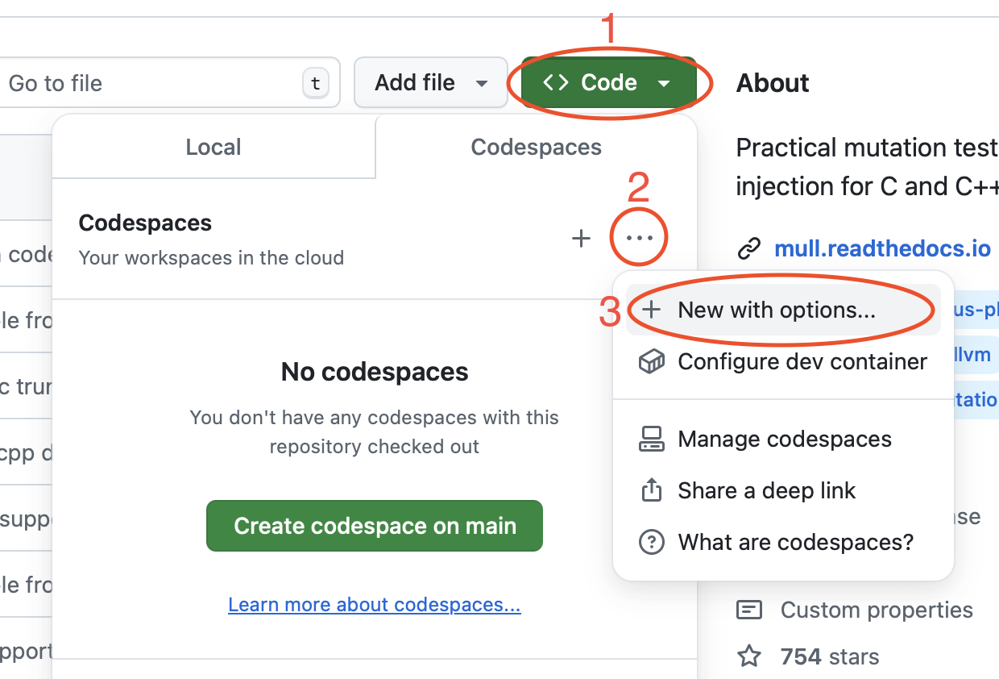
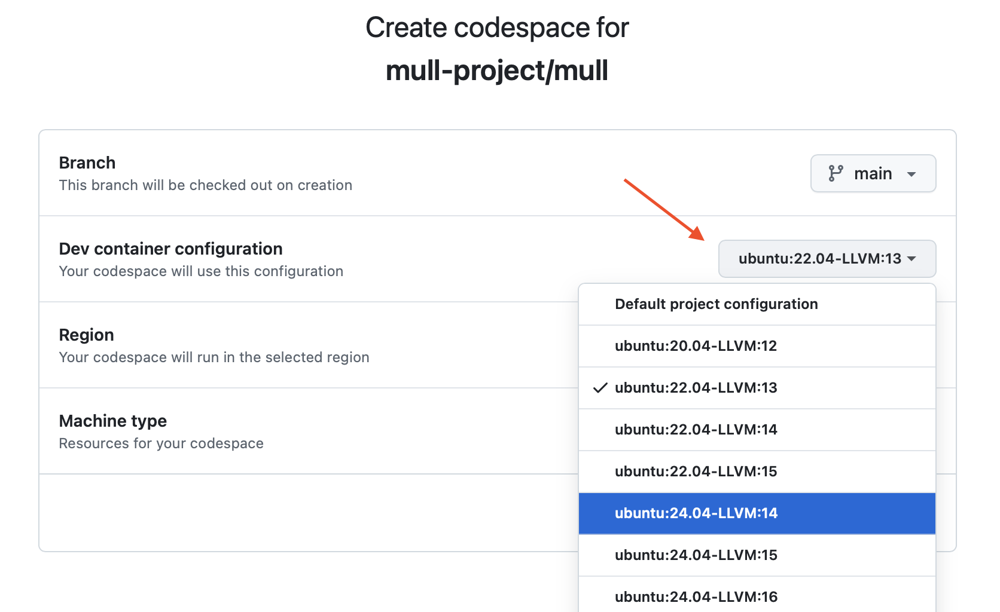

Hacking On Mull
===============

.. include:: ./_support.rst

Codespaces and Devcontainers
****************************

For development on Linux, Mull provides `devcontainers <https://containers.dev>`_ that can be used either via `Codespaces <https://github.com/features/codespaces>`_ or locally.

Codespaces
----------

To start a Codespace, go to the Mull's GitHub page and follow ``Code -> Codespaces -> Dots (...) -> New with options``:

|

|

Then choose the right combination of OS/LLVM version and hit `Create Codespace`:

|

|

After a couple of minutes you'll get a fully functional dev environment ready for hacking.

Follow this `doc <https://docs.github.com/en/codespaces/developing-in-a-codespace/using-github-codespaces-in-visual-studio-code>`_
to connect to a Codespace from your local machine.

Devcontainers
-------------

You can get similar setup locally via Devcontainers.

The following commands setup a devcontainer using ``Ubuntu 24.04, LLVM 17`` and build&run Mull's test suite.

.. code-block:: bash

    npm install -g @devcontainers/cli
    devcontainer up --workspace-folder . --config ./.devcontainer/ubuntu_24.04_17/devcontainer.json
    devcontainer exec --workspace-folder . --config ./.devcontainer/ubuntu_24.04_17/devcontainer.json bash
    bazel build ...
    bazel test ...

Follow these `instructions <https://code.visualstudio.com/docs/devcontainers/containers>`_
to connect to a devcontainer from VSCode.

Internals
*********

For better understanding of Mull's internals it may be helpful to get through the second and third sections of this paper:
`Mull it over: mutation testing based on LLVM <https://lowlevelbits.org/pdfs/Mull_Mutation_2018.pdf>`_
from `ICST 2018 <https://www.es.mdh.se/icst2018/>`_.
