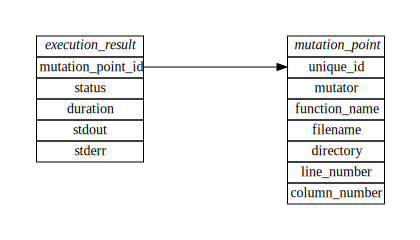

Working with SQLite report
==========================

**Warning: the data model has changed and most of the tutorial is no longer relevant/applicable**

From the very beginning, we didn't want to impose our vision on treating the results of mutation testing. Some people do not care about the mutation score, while others do care, but want to calculate it slightly differently.

To solve this problem, Mull splits execution and reporting into separate phases.
What Mull does is apply mutation testing on a program, collect as much information as possible, and then pass this information to one of several reporters.

At the moment of writing, there are three reporters:

- ``IDEReporter``: prints mutants in the format of clang warnings
- ``MutationTestingElementsReporter``: emits a JSON-file compatible with `Mutation Testing Elements <https://github.com/stryker-mutator/mutation-testing-elements>`_.
- ``SQLiteReporter``: saves all the information to an SQLite database

One of the ways to do a custom analysis of mutation testing results is to run queries against the SQLite database. The rest of this document describes how to work with Mull's SQLite database.

Database Schema
---------------

The following picture describes part of the existing database:

*Some fields and tables irrelevant for this document are omitted.*

Let's take a brief look at each table.

*test*
******

This table contains information about a particular test. A test, from Mull's
perspective, is just a function. For UI reporting purposes, Mull records the
location of the function.

*mutation_point*
****************

This is one of the core elements of Mull. The mutation point describes what was changed and where. The ``mutator`` field stores name of a `mutation operator <SupportedMutations.html>`_ applied at this mutation point. The rest of the fields describe the physical location of the mutation.

*execution_result*
******************

Execution results are stored separately from mutation points for the following reasons:

- a mutation point might be reachable by more than one test. Therefore Mull runs several tests against one mutation point
- to gather code coverage information Mull runs all the tests one by
  one without any mutations involved

In other words, ``execution_result`` describes many-to-many relation between tests and mutations.

Empty ``mutation_point_id`` indicates that a test was run to gather code coverage information.

The ``status`` field stores a numerical value as described in the following table:

.. list-table::
   :header-rows: 1

   * - Numeric value
     - String Value
     - Description
   * - 1
     - Failed
     - test has failed (the exit code does not equal 0)
   * - 2
     - Passed
     - test has passed (the exit code equals 0)
   * - 3
     - Timedout
     - test execution took more time than expected
   * - 4
     - Crashed
     - test program was terminated
   * - 5
     - AbnormalExit
     - test program exited (some test frameworks call ``exit(1)`` when test fails)
   * - 6
     - DryRun
     - test was not run (DryRun mode enabled)
   * - 7
     - FailFast
     - mutant was killed by another test so this test run can be skipped

Running Queries
---------------

The benefit of having results in an SQLite database is that we can run as many queries as we want and to examine the results without re-running Mull, which can be a long-running task.

If you don't have a sample project ready, then it is a good idea to check out the `fmtlib tutorial <fmtlibTutorial.html>`_.

To enable SQLite reporter, add ``-reporters=SQLite`` to the CLI options.
It is also recommended to specify the report name via ``-report-name``, e.g.:

.. code-block::

    mull-cxx -test-framework=GoogleTest \
      -mutators=cxx_add_to_sub \
      -compdb-path compile_commands.json \
      -compilation-flags="\
        -isystem /opt/llvm/5.0.0/include/c++/v1 \
        -isystem /opt/llvm/5.0.0/lib/clang/5.0.0/include \
        -isystem /usr/include \
        -isystem /usr/local/include" \
      -reporters=SQLite \
      -report-name=tutorial \
      ./bin/core-test

In the end, you should see something like this:

.. code-block::

    [info] Results can be found at './tutorial.sqlite'

Open the database and enable better formatting (optional):

.. code-block::

    sqlite3 ./tutorial.sqlite
    sqlite> .header on
    sqlite> .mode column

Now you can examine contents of the database:

.. code-block::

    sqlite> .tables
    config                mutation_point        mutation_result
    execution_result      mutation_point_debug  test

    sqlite> .schema execution_result
    CREATE TABLE execution_result (
      test_id TEXT,
      mutation_point_id TEXT,
      status INT,
      duration INT,
      stdout TEXT,
      stderr TEXT
    );

As you can see, the schema for ``execution_result`` matches the one on the picture above.

Basic exploration
*****************

Let's check how many mutants:

.. code-block::

    sqlite>  select count(*) from mutation_point;
    count(*)
    ----------
    35

Let's see some stats on the execution time:

.. code-block::

    sqlite> select avg(duration), max(duration) from execution_result;
    avg(duration)     max(duration)
    ----------------  -------------
    5.23497267759563  76

Let's see what's wrong with that slow test run:

*Note: Here, I use several queries to save some screen space. Locally you may combine this into one query just fine.*

.. code-block::

    sqlite> select rowid, status, duration from execution_result order by duration desc limit 5;
    rowid       status      duration
    ----------  ----------  ----------
    73          3           76
    54          1           22
    55          1           19
    179         1           17
    5           2           14
    sqlite> select test_id from execution_result where rowid = 73;
    test_id
    -----------------------
    FormatDynArgsTest.Basic
    sqlite> select mutation_point_id from execution_result where rowid = 73;
    mutation_point_id
    -----------------------------------------------------------------------------------------
    3539da16613cf5da12032f308b293b8f_3539da16613cf5da12032f308b293b8f_478_2_15_cxx_add_to_sub

Now, we now the exact test case and exact mutation we can identify their locations in the source code:

.. code-block::

    sqlite> select * from test where unique_id = "BufferTest.Access";
    test_name          unique_id          location_file                            location_line
    -----------------  -----------------  ---------------------------------------  -------------
    BufferTest.Access  BufferTest.Access  /tmp/sc-UiYEtcmuH/fmt/test/core-test.cc  144

    sqlite> select mutator, filename, line_number, column_number from mutation_point
      where unique_id = "3539da16613cf5da12032f308b293b8f_3539da16613cf5da12032f308b293b8f_478_2_15_cxx_add_to_sub";
    mutator         filename                                    line_number  column_number
    --------------  ------------------------------------------  -----------  -------------
    cxx_add_to_sub  /tmp/sc-UiYEtcmuH/fmt/include/fmt/format.h  1746         45

Deeper dive
***********

Exploration via SQLite is cool, but let's do some math and calculate the mutation score using SQL.

To calculate mutation score, we will use the following formula: ``# of killed mutants / # of all mutants``, where killed means that the status of an ``execution_result`` is anything but ``Passed``.

Counting all the killed mutants is not the most straightforward query, but
should still be bearable: select all the mutation points and then narrow down the results by selecting the ones where the execution status does not equal 2 (Passed).

.. code-block::

    sqlite> select mutation_point.unique_id as mutation_point_id from mutation_point
          inner join execution_result on execution_result.mutation_point_id = mutation_point.unique_id
          where execution_result.status <> 2
          group by mutation_point_id;

Reusing this query is a bit of a hassle, so it makes sense to create an SQL View which can be used as a normal table:

.. code-block::

    sqlite> create view killed_mutants as
          select mutation_point.unique_id as mutation_point_id from mutation_point
          inner join execution_result on execution_result.mutation_point_id = mutation_point.unique_id
          where execution_result.status <> 2
          group by mutation_point_id;
    sqlite> select count(*) from killed_mutants;
    count(*)
    ----------
    16

With the number of killed mutants in place we can calculate the mutation score:

.. code-block::

    sqlite> select round(
        (select count(*) from killed_mutants) * 1.0 /
        (select count(*) from mutation_point) * 100) as score;
    score
    ----------
    46.0

Gotchas
*******

One important thing to remember: by default Mull also stores ``stderr`` and ``stdout``
of each test run, which can blow up the size of the database by tens on gigabytes.

If you don't need the ``stdout/stderr``, then it is recommended to disable it via one of the following options ``--no-output``, ``--no-test-output``, ``--no-mutant-output``.

Alternatively, you can strip this information from the database using this query:

.. code-block::

    begin transaction;
    create temporary table t1_backup as select test_id, mutation_point_id, status, duration FROM execution_result;
    drop table execution_result;
    create table execution_result as select * FROM t1_backup;
    drop table t1_backup;
    commit;
    vacuum;
